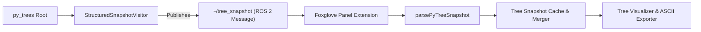

# Behavior Tree Snapshot & Profiler Architecture

The Behavior Tree Profiler serializes tree execution metrics into structured ROS 2 messages and feeds them directly into Foxglove Studio for real-time visualization and performance analysis:



## Layers

| Layer | Responsibility |
| --- | --- |
| `py_trees` Runtime | Executes node logic, transitions states, and ticks behaviours |
| `StructuredSnapshotVisitor` | Profiles execution durations, interval spans, retry attempts, and subtree timing |
| `mission_planner_interfaces/msg/BehaviourTreeSnapshot.msg` | Top-level message containing ROS 2 header, tick count, text backup, and node arrays |
| `mission_planner_interfaces/msg/BehaviourNodeSnapshot.msg` | Per-node snapshot with hierarchical paths, status enums, timing metrics, and retry state |
| `mission_planner_interfaces/msg/AttemptSnapshot.msg` | Granular timing and status metrics per retry attempt path (`x0`, `x1`, `x0,1`, ...) |
| `parsePyTreeSnapshot` | Universal parser ingesting ROS 2 messages or fallback raw text into `ParsedTreeNode[]` |
| Panel State & Cache | Merges incoming frames with cached persistent tree state for uninterrupted UI rendering |

---

## Message Schema Definitions

### 1. `mission_planner_interfaces/msg/AttemptSnapshot.msg`
```text
uint32 attempt_index
uint32[] attempt_indices
string attempt_key
string ticks
string seconds
uint32 ticks_num
float64 seconds_num
uint32 self_ticks
float64 self_seconds
uint32 sub_ticks
float64 sub_seconds
uint32 start_tick
uint32 end_tick
bool is_same_tick
string feedback
uint8 status
string status_str
```

### 2. `mission_planner_interfaces/msg/BehaviourNodeSnapshot.msg`
```text
# Node status constants
uint8 STATUS_INVALID = 0
uint8 STATUS_UNVISITED = 1
uint8 STATUS_RUNNING = 2
uint8 STATUS_SUCCESS = 3
uint8 STATUS_FAILURE = 4

# Node identification and hierarchy
string id
string name
string behaviour_type
string symbol
uint32 depth
string parent_id
string[] child_ids
bool has_children
bool is_active

# Status representation
uint8 status
string status_raw
string status_str

# Retry metadata
int32 attempts
int32 max_attempts
string retry_str

# Cumulative timing and profiling metrics
string ticks
string seconds
uint32 ticks_num
float64 seconds_num
uint32 self_ticks
float64 self_seconds
uint32 sub_ticks
float64 sub_seconds
uint32 start_tick
uint32 end_tick
bool is_same_tick

# Feedback & text rendering
string feedback
string raw_line

# Detailed attempt history for retried nodes
AttemptSnapshot[] attempt_history
```

### 3. `mission_planner_interfaces/msg/BehaviourTreeSnapshot.msg`
```text
std_msgs/Header header
uint32 global_tick_count
BehaviourNodeSnapshot[] nodes
string raw_text_tree
```

---

## Conventions

- **Hierarchical Node Paths**: IDs are generated deterministically as `/{parent_name}/{child_name}`. Sibling collisions are resolved with index suffixes (e.g., `/{parent}/Wait#1`).
- **Composite Timing Strings**: Composites format metrics as `span_t (self_t sub_t) / span_s (self_s sub_s) @start_tick-end_tick` (e.g., `338t (0t 338t) / 33.70s (0.00s 33.70s) @1-338`).
- **Leaf Timing Strings**: Leaf nodes omit subtree breakdown and format metrics as `span_t / span_s @start_tick-end_tick` (e.g., `21t / 2.10s @1-21`).
- **Time Measurements**: Elapsed durations are calculated using ROS clock simulation time (`node.get_clock().now()`).
- **Status Mapping**:
  - `STATUS_UNVISITED` (`1`): `-` ("unvisited")
  - `STATUS_RUNNING` (`2`): `*` ("running")
  - `STATUS_SUCCESS` (`3`): `✓` ("success")
  - `STATUS_FAILURE` (`4`): `✕` ("failure")
- **Visual Symbols**:
  - `{-}`: Sequence with memory
  - `[-]`: Sequence without memory
  - `{o}`: Selector with memory
  - `[o]`: Selector without memory
  - `/_/`: Parallel composite
  - `-^-`: Decorator / Retry node
  - `-->`: Action / Condition behaviour leaf
- **Retry Attempt Partitioning**: `attempt_index` is the innermost retry index. `attempt_indices` preserves the complete outer-to-inner retry path, and `attempt_key` is its comma-separated lookup key (`0`, `0,1`, ...). The Retry decorator tracks cumulative span while retry-aware nodes expose per-path metrics and status.
- **Latched Status**: Ordinary nodes retain their last terminal `SUCCESS` or `FAILURE` when they become unvisited on later ticks. Nodes inside or representing a Retry decorator retain status independently for each attempt path. `RUNNING` remains the current live state.
- **FailureIsSuccess**: A `FailureIsSuccess` decorator is reported as its concrete `behaviour_type`; the profiler identifies and displays it explicitly while preserving the child failure status.
- **Transport**: `StructuredSnapshotVisitor` publishes `mission_planner_interfaces/msg/BehaviourTreeSnapshot` on the private `~/tree_snapshot` topic. `raw_text_tree` is a human-readable backup, not the primary transport.
- **Backward Compatibility**: `parsePyTreeSnapshot` accepts structured ROS 2 message objects, legacy `{ data: string }` wrappers, raw tree strings, and node arrays.

---

## Hierarchical Traversal & Metric Aggregation

1. `initialise()` advances `global_tick_count` and records the current ROS clock time for the tick.
2. `run()` records execution intervals and retry-path status for each visited node.
3. Before emitting the snapshot, `_accumulate_times()` traverses the behavior tree from the bottom up to calculate span, subtree, and self durations for every node.
4. `metrics_map[node.id]` stores cumulative timing and per-attempt metrics for the tree.
5. `_build_paths_recursive()` establishes tree depth and assigns unique `/parent/child` IDs before serialization.
6. `finalise()` resolves latched/current status, attaches attempt histories, formats `raw_line` representations, and publishes `BehaviourTreeSnapshot.msg`.

---

## First checks when something fails

```bash
# Check if the snapshot topic is publishing and verify structure
ros2 topic echo /tree_snapshot_publisher/tree_snapshot --once

# Inspect ROS 2 message type definition
ros2 interface show mission_planner_interfaces/msg/BehaviourTreeSnapshot

# Check publication frequency
ros2 topic hz /tree_snapshot_publisher/tree_snapshot

# Verify ROS sim time is progressing
ros2 topic echo /clock --once
```

- **Only root node shows metrics**: Ensure `_accumulate_times` passes `metrics_map` recursively through all children so child nodes do not default to empty metrics.
- **Foxglove displays `[object Object]`**: Verify `parsePyTreeSnapshot` is receiving the message object directly rather than coercing with `String(rawMsg)`.
- **Timing shows `0.00s` while ticks increment**: Ensure `/clock` is publishing and the ROS 2 node is configured with `use_sim_time:=True`. A one-tick interval can legitimately round to `0.00s`.
- **Node IDs mismatch across ticks**: Ensure duplicate sibling names are not reordered dynamically; use static names or verify `#1`, `#2` suffix preservation in `_build_paths_recursive`.
- **A completed node becomes unvisited**: Check that the same `StructuredSnapshotVisitor` instance remains attached to the tree and that the node ID is stable. Terminal status is latched in the visitor, not reconstructed from the current `visited` set.
- **Retry status appears on the wrong attempt**: Inspect `attempt_indices` and `attempt_key`; nested retries require the full path, not only `attempt_index`.